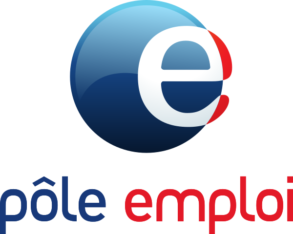

## Work Experience

 Malt 

Sep 2024 - Present

Data Scientist / Applied Economist

 Lead the evaluation of AI-powered matching and recommendation systems, measuring their impact on user behavior and marketplace outcomes. Establish experimentation methodologies and provide analytical expertise on high-impact product decisions. Develop methods to detect and mitigate algorithmic biases, contributing to responsible AI practices and research partnerships with academic institutions 

  France Travail 

Jan 2021 - Sep 2024

Data Scientist, PhD Researcher

 Designed and evaluated large-scale AI-driven matching and recommendation systems serving millions of job seekers. Led end-to-end adaptive experimentation projects using multi-armed bandits. Evaluated the fairness of recommendation algorithms, identifying risks and proposing mitigation strategies. Led multidisciplinary projects with software engineers, caseworkers, economists, and behavioral scientists 

 

 World Bank 

Aug. 2020 - Nov. 2020
 

 

Short-term Consultant

 Provided research support on the use of Generic Machine Learning methods for analyzing heterogeneity in randomized trials 

 

 European Central Bank 

Jan. 2019 - Oct. 2019
 

 

Research Assistant

 Provided research support for financial experts in the Financial Stability Surveillance Division. - Edited the Financial Stability Review, focusing on the non-bank financial sector

 

 Rexecode 

Jun 2018 - Dec. 2018
 

 

Consultant (Intern)

Edited the Monthly Report on the Economic Situation in Spain and Latin America. - Responsible for the annual report on the competitiveness of France 

## Education
 

 

 CREST 

April 2021 - Present
 

 

 PhD in Economics 

 Supervisors : Arne Uhlendorff, Bruno Crépon 

 

 ENSAE 

2019 - 2020 
 

 

 Master in Data Science 

<!-- 
 Thesis title 
 -->

 

 Paris School of Economics 

2016 - 2018 
 

 

 Master in Economics 

<!-- 
 Thesis title 
 -->

## Teaching

 

 Paris I Panthéon-Sorbonne 

April 2021 - Present
 

 

 Teaching Assistant in Econometrics

 Introduction to formal statistical theory of linear regression model, intuitive understanding of the principles of econometric analysis and basic applications on real data with R 

 

 ENSAE 

2020 - 2023 
 

 

 Statistics Project Supervisor 

Supervision of groups of students in machine learning projects (Natural Language Processing, Recommendation Algorithms, Machine Learning methods for heterogeneity analysis in randomized experiment)

